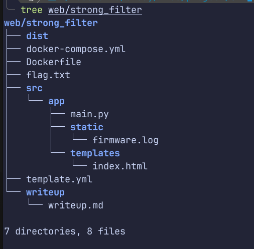

# CTF Challenge Repository

## How It Works

The `deploy_ctfd_challenge.sh` script automates challenge deployment by:
1. Looking for a `docker-compose.yaml` or `docker-compose.yml` in the challenge folder
2. Running `docker-compose up -d` to start the challenge containers
3. Making the challenge accessible on the configured ports

## Deploying a Challenge

Deploy any challenge by providing its path:

```bash
./deploy_ctfd_challenge.sh "pwn/safe_printf"
./deploy_ctfd_challenge.sh "web/strong_filter"
```

## Creating a New Challenge

Generate a challenge template:

```bash
./generate_template.sh
```

Or create manually:

1. Create a folder under the appropriate category (`pwn/`, `web/`, `crypto/`, etc.)
2. Add these required files:
   - `docker-compose.yaml` - defines the service and ports
   - `Dockerfile` - builds the challenge environment
   - `flag.txt` - contains the flag
   - `src/` - your challenge source code
   - `dist/` - handouts for the player
   - `writeup/` - solution and exploit

3. Deploy using the script:
   ```bash
   ./deploy_ctfd_challenge.sh "category/your_challenge"
   ```

## Example Challenge Structure
```
category/challenge_name/
├── docker-compose.yaml
├── Dockerfile
├── flag.txt
├── src/
├── dist/
└── writeup/
```

<p float="left">
  
  
</p>